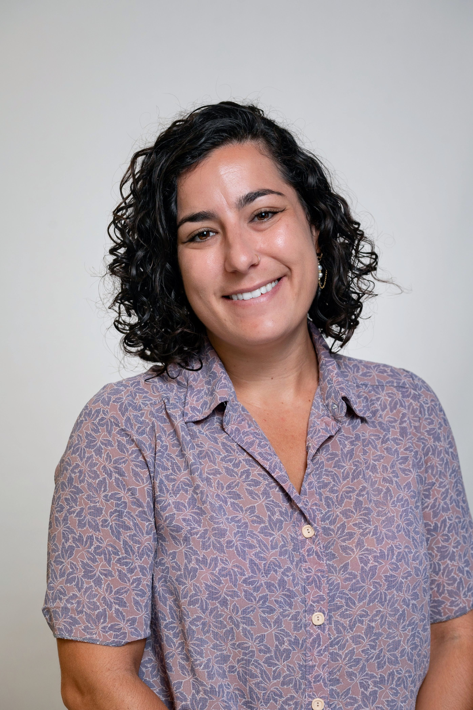

# About Me
---

I was born in Tel Aviv and grew up in the heart of the Silicon Valley in California. I was lucky enough to stay in the Bay Area and live in the wonderful, vibrant city of Berkeley for college. In 2017, I (reluctantly) relocated to Princeton and immediately encountered, for the first time, the word _muggy_ as a weather descriptor. I loved the trees and small independent businesses (especially Rojo's Roastery, the Bent Spoon, Whole Earth Center, and the Garden Theater) in that little town, but was happy to move to a bigger city after six years. I love my neighborhood (Ravenswood) and am thrilled to be in Chicago for the foreseeable future. 

Apart from research and teaching, I enjoy practicing yoga, reading, writing, sailing, [film photography](https://www.art-by-goni.me/), printmaking, baking, and many other things. I love coffee (especially medium to dark roast pour-overs), vegetarian foods of various kinds, and fresh figs.
