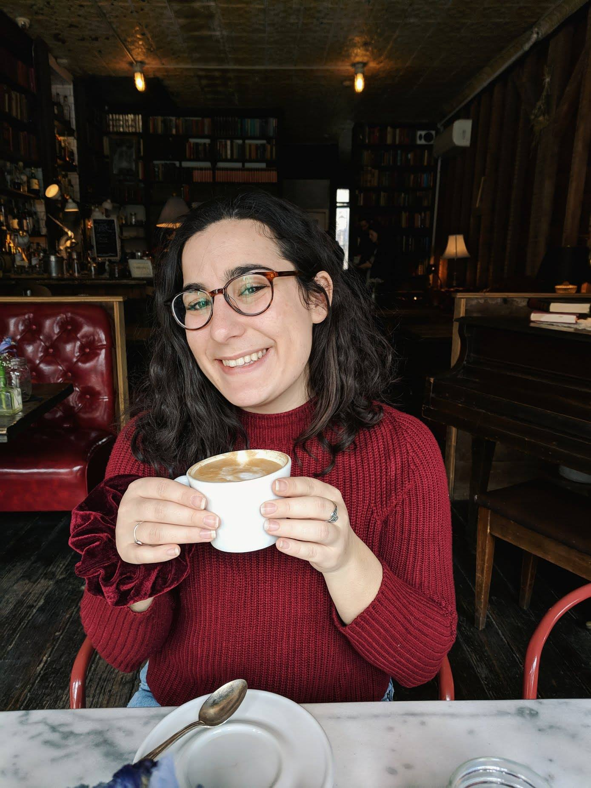

# About Me
---

I was born in Tel Aviv, Israel, and grew up in the heart of the Silicon Valley in California. I was lucky enough to stay in the Bay Area and live in the wonderful, vibrant city of Berkeley for college. In 2017, I (reluctantly) relocated to Princeton and immediately encountered, for the first time, the word _muggy_ as a weather descriptor. The most disappointing things about living in Princeton are the summers, the winters, scary thunderstorms during both, a lackluster restaurant and bar scene, needing to own a brush and a scraper, and being way _way_ **way** too far from my family's dog, Kaya. They have nice trees here, though.

Apart from physics and astronomy, I enjoy reading, writing, traveling, sailing, spending time outdoors (especially near or in bodies of water), and all forms of art. I make linoleum blockprints as often as possible, rarely go anywhere without a book, and would love to visit just about everywhere in the world. Currently, Morocco, where my maternal grandparents are from, is at the top of the list. I love coffee (see photographic evidence) and love to work, read, or talk with friends at coffeeshops. I'm also a big fan of good vegetarian food, dark beers (stouts > IPAs forever), kombucha, and açaí bowls.
