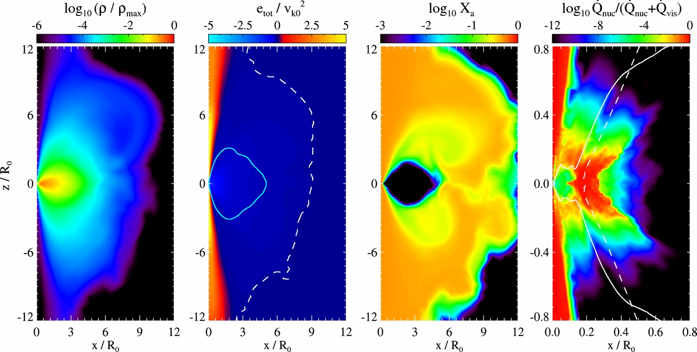
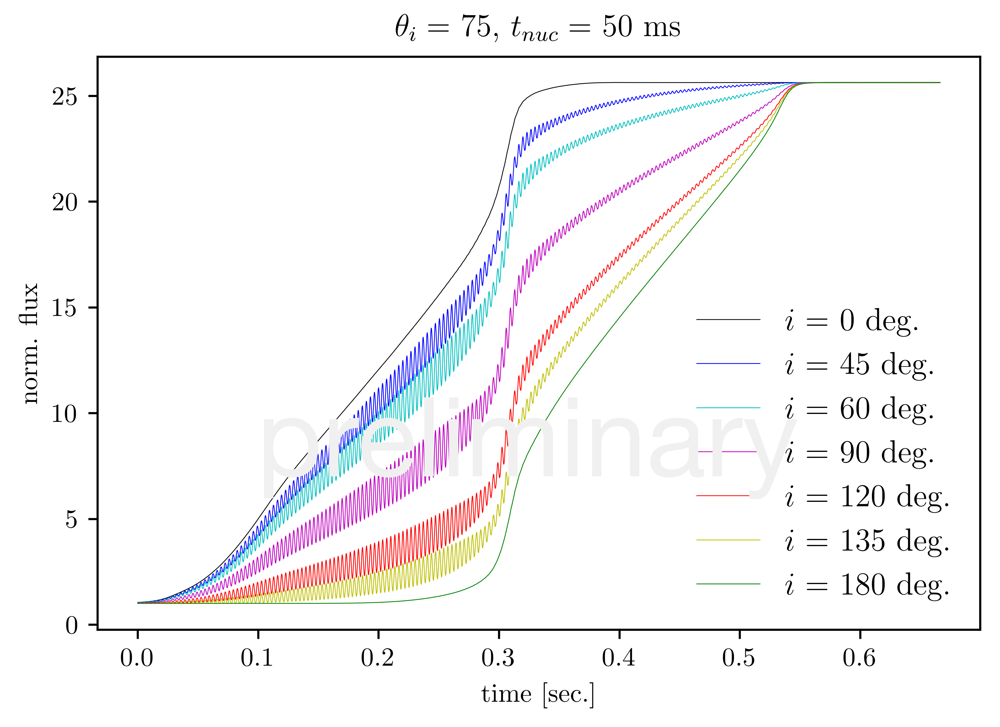

# Research
---
Full lists of my publications can be found on [ADS](https://ui.adsabs.harvard.edu/#search/q=author%3A%22Halevi%2C%20Goni%22&sort=date%20desc%2C%20bibcode%20desc)/[ORCID](https://orcid.org/0000-0002-7232-101X)/[arXiv](https://arxiv.org/search/?query=halevi%2Cgoni&searchtype=all&source=header)

---

## Works in progress
### Nuclear reactions in NS-WD accretion disks
Starting in January 2018, I have been working to implement a nuclear reaction network within the MHD code [Athena++](https://princetonuniversity.github.io/athena/) with the goal of simulating the evolution of the torus that forms when a white dwarf is disrupted by a companion neutron star. Accretion disks formed in this way are interesting because the timescales for nuclear reactions to occur can be comparable to the dynamical time in the disk, such that energy deposited by these reactions can dynamically affect the disk structure. Past work has shown that for certain progenitor choices, detonations occur and power a relatively low-luminosity, rapidly-evolving transient. In collaboration with [Jim Stone](https://www.astro.princeton.edu/~jstone/), I plan to check whether we can reproduce these results in MHD, with real MRI-driven turbulence rather than an alpha viscosity. We hope to verify under which conditions these detonations happen and look into the detailed effects of nuclear reactions on the disk and of turbulence on the composition and structure of the torus. Relevant references include: [Zenati et al. (2018)](https://ui.adsabs.harvard.edu/#abs/2018arXiv180709777Z/abstract); [Fernández & Metzger (2013)](https://ui.adsabs.harvard.edu/#abs/2013ApJ...763..108F/abstract); and [Margalit & Metzger (2016)](https://ui.adsabs.harvard.edu/#abs/2016MNRAS.461.1154M/abstract).

<small>Source: Fernández & Metzger (2013).</small>

### Modeling type I X-ray bursts
Since starting at Princeton in September 2017, I have been running simplified simulations of Type I X-ray bursts and modeling their light curves. These bursts occur when an accreting neutron star in a low-mass X-ray binary (LMXB) is ignited due to the compression of accreted material at the NS surface. Observations of these bursts leave some questions unanswered. For example, it is unclear where the ignition first occurs, how fast it spreads, and how these factors affect the observed light curves. There are also mysteries such as why the high frequency oscillations in the light curve, presumably caused by the rotation of the star, get higher in frequency as the burst proceeds. In order to shed light on some of this uncertainty, I execute spectral codes ([SPHEREPACK](https://www2.cisl.ucar.edu/resources/legacy/spherepack) and [Dedalus](http://dedalus-project.org)) that solve the two-dimensional shallow-water equations to evolve the burning front on the spherical surfaces of model neutron stars. I am experimenting with different parameters including the timescale for burning and the latitude of ignition. I also wrote a light curve generator that takes into account general relativistic effects in calculating the resultant light curves from these simulations. The goal is to compare simulated light curves with observed ones and draw some conclusions about the physics of the ignition and burning front propagation in observed bursts. This work, done in collaboration with [Anatoly Spitkovsky](https://www.astro.princeton.edu/~anatoly/), largely builds off of [Spitkovsky et al. (2002)](https://ui.adsabs.harvard.edu/#abs/2002ApJ...566.1018S/abstract).

<small>[Preliminary results] Simulated light curves for the rise of an X-ray burst in the case where the nuclear burning time is 50 ms and the ignition occurs at a latitude of 75 degrees. The different colors represent different viewing inclinations.</small>

### Dynamics of jet-driven supernovae
in collab with philipp, blah blah (include figs)

---

## Completed (undergraduate) work
### r-process nucleosynthesis in jet-driven supernovae
Working in collaboration with Philipp Mösta and others, beginning in early 2016, I explored the question of where the heaviest elements in the universe are synthesized in space. The conditions required for the r-process, a rapid succession of neutron captures followed by beta decays, are rare. The question of where, astrophysically, these conditions are met is one that people have been trying to answer for decades without much success. Recently, and especially in the past year, a lot of progress has been made; in particular, it's been shown directly that r-process elements get produced in neutron star mergers. However, there remain details to be worked out: are they produced anywhere else in the universe? What are the typical yields and rates of the events that produce r-process elements? Are they compatible with observations of abundances in metal-poor stars and dwarf galaxies? It remains possible that there is another channel, or even multiple channels, for r-process nucleosynthesis to occur, although it may not dominate in most environments.
To investigate this, we specifically looked at the possibility of a special class of core-collapse supernovae producing r-process elements. These supernovae require rapidly rotating and highly magnetized pre-collapse cores that produce jetted explosions. Our simulations of these events were run with the general relativistic 3D MHD [Einstein Toolkit](https://einsteintoolkit.org/) and in post-processing, we used a nuclear reaction network called [SkyNet](http://jonaslippuner.com/research/skynet/) to calculate the final abundances of each isotope. We performed a robust study that included various magnetic field orientations, parameterization of neutrino effects, and evidence of the importance of 3D dynamics. Ultimately, we found that with sufficiently strong initial magnetic fields, the thermodynamic conditions in the jet and in particular the abundance of free neutrons are sufficient for producing the full spectrum of r-process elements. However, the magnetic fields that we need to impose are potentially unrealistically strong, calling into question the applicability of this channel in the real universe.
For more information, see the two papers that have come out of these endeavours: [**Halevi** & Mösta (2018)](https://ui.adsabs.harvard.edu/#abs/2018MNRAS.477.2366H/abstract) and [Mösta, Roberts, **Halevi** et al. (2018)](https://ui.adsabs.harvard.edu/#abs/2017arXiv171209370M/abstract).

 

<small>Blah blah.</small>

### Observations: supernovae and AGN
link papers and ATels, blah blah (figs)
